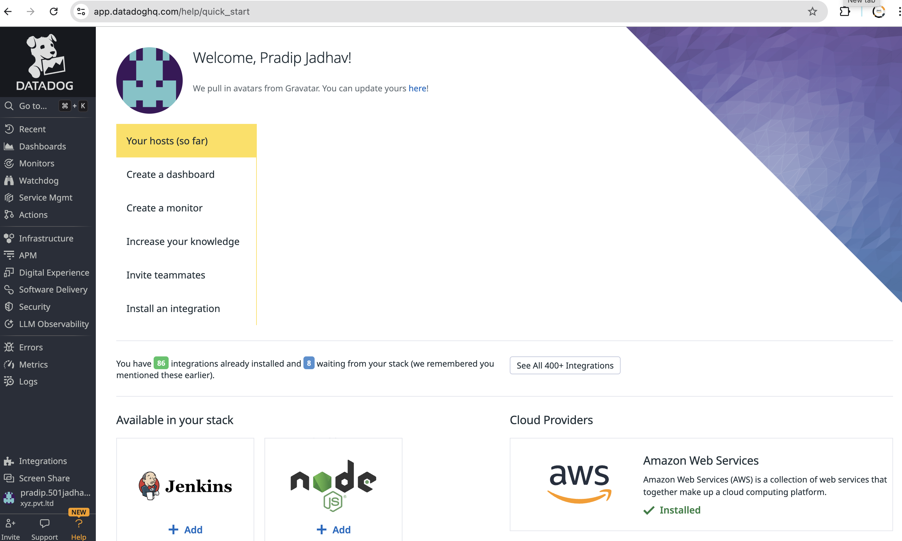
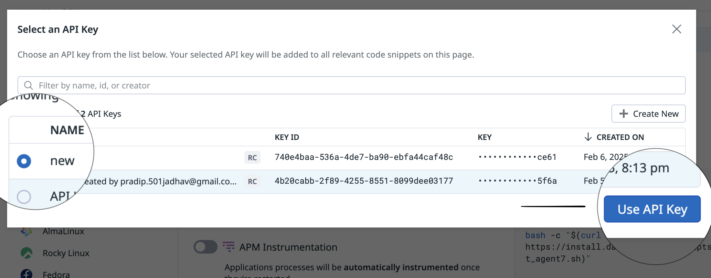
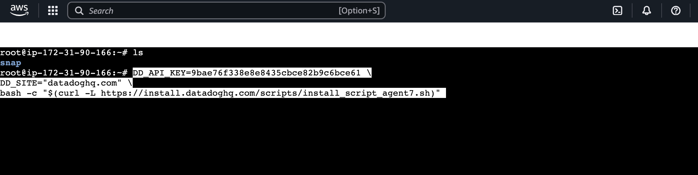
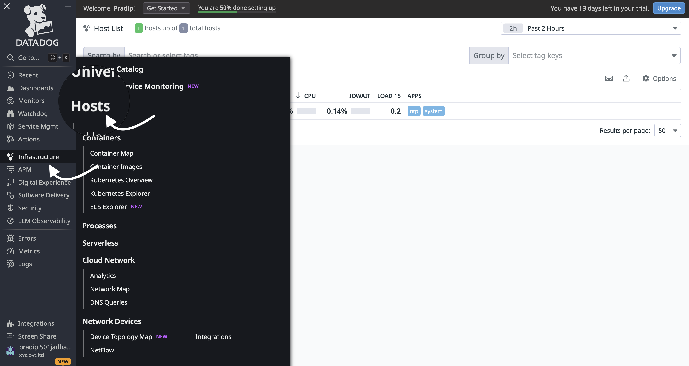
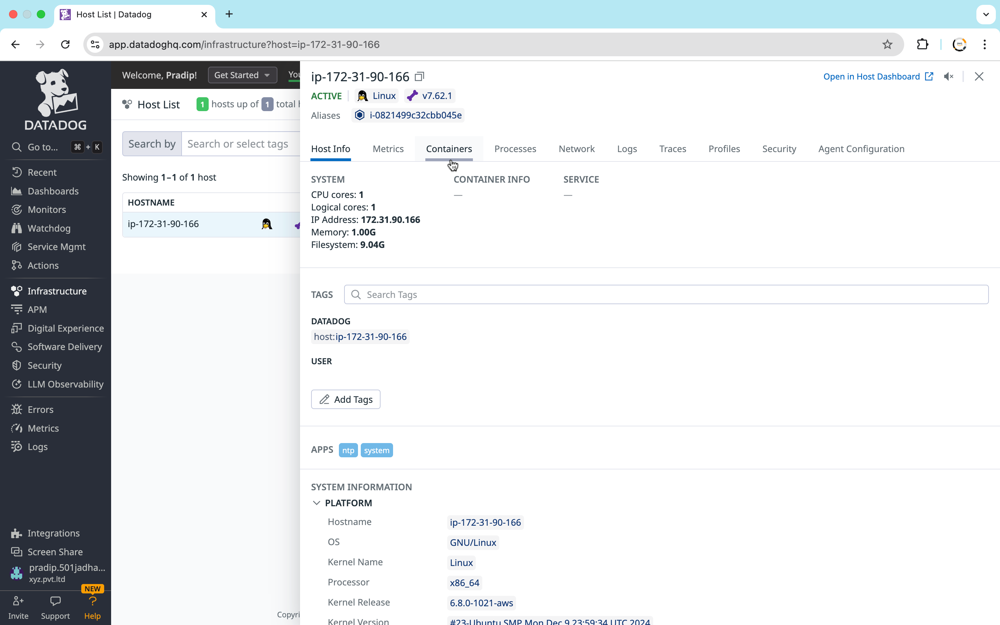

# Monitoring Tool: Datadog

## Introduction to Datadog
Datadog is a cloud-based monitoring and security platform for developers, IT teams, and security engineers. It provides real-time observability into applications, infrastructure, logs, and security insights.

### Key Features:
- Infrastructure Monitoring
- Log Management
- Application Performance Monitoring (APM)
- Security Monitoring
- Real-time Dashboards

---
# Datadog Dashboard Documentation



## Overview
This document provides details about the Datadog dashboard, including its purpose, key metrics, logs, and alerts.

## Dashboard Name: `Your Dashboard Name`
**Description:** Briefly explain the purpose of this dashboard (e.g., monitoring application performance, tracking infrastructure metrics, etc.).

## Dashboard URL
Provide the Datadog dashboard link if applicable: `[Datadog Dashboard Link](#)`

## Sections & Widgets

### 1. Recent Dashboard
- **Latest Updates**
  - Displays recent changes and updates to the dashboard.

### 2. Monitor & Watchdog
- **Active Alerts & Monitoring**
  - Overview of current alerts and automated anomaly detection.

### 3. Service Management
- **Service Health Metrics**
  - Tracks the status of various services.

### 4. Actions in Depth
- **Detailed Analysis of Alerts & Events**
  - Provides deep insights into triggered actions and responses.

### 5. Infrastructure
- **System Performance Overview**
  - Tracks system resource utilization.

### 6. In-depth Analysis
- **Granular Insights**
  - Provides deeper insights into system and service health.

### 7. APM (Application Performance Monitoring)
- **Application Metrics & Tracing**
  - Monitors performance of deployed applications.

### 8. Digital Experience
- **User Interaction & Performance**
  - Measures frontend and backend performance from a user perspective.

### 9. Software Delivery
- **Deployment & CI/CD Monitoring**
  - Tracks software deployment cycles and success rates.

### 10. Security
- **Threat Detection & Vulnerability Monitoring**
  - Analyzes potential security risks and compliance issues.

### 11. LLM Observability
- **AI Model Performance & Logs**
  - Observes large language models and their operational metrics.

### 12. Errors & Metrics
- **Error Rate & Key Metrics**
  - Tracks system-wide error rates and performance indicators.

### 13. Logs & Integration
- **Log Streams & External Integrations**
  - Displays logs and connects with external services for monitoring.

## Contact
For any issues or enhancements, contact `your-email@domain.com` or raise an issue in the repository.


## Installing the Datadog Agent on Linux 

# Installing Datadog Agent on Ubuntu

## Prerequisites
- Ubuntu 20.04 or later
- Sudo or root access
- Datadog API key (create one if you don't have it)


## Step 1: Go to Datadog Integrations
1. Log in to your [Datadog account](https://app.datadoghq.com/).
2. Navigate to **Integrations**.
3. Select **Agent**.
4. Choose **Ubuntu** as the integration platform.



## Step 2: Obtain API Key
- If you already have an API key, proceed to the next step.
- If not, create a new API key in your Datadog account.



## Step 3: Run Installation Command on Ubuntu Server
1. Copy the installation command provided by Datadog.
2. SSH into your Ubuntu server.
3. Paste and run the command in the terminal.

## Step 4: Start and Enable Datadog Agent
```sh
sudo systemctl start datadog-agent
sudo systemctl enable datadog-agent
```

## Step 5: Verify Integration on Datadog Dashboard
1. Go to the **Datadog Dashboard**.
2. Navigate to **Infrastructure**.
3. Select **Host** to view the integrated Ubuntu server.



## Setup Complete
Your Ubuntu server is now integrated with Datadog and ready for monitoring!


3. **Verify Installation**
   ```bash
   sudo systemctl status datadog-agent
   ```

### Installing Datadog Agent on Docker
1. **Run the Datadog Agent as a Docker container:**
   ```bash
   docker run -d --name datadog-agent \
     -e DD_API_KEY=<YOUR_API_KEY> \
     -e DD_SITE="datadoghq.com" \
     -v /var/run/docker.sock:/var/run/docker.sock:ro \
     -v /proc/:/host/proc/:ro \
     -v /sys/fs/cgroup/:/host/sys/fs/cgroup:ro \
     datadog/agent:latest
   ```

2. **Check Logs**
   ```bash
   docker logs datadog-agent
   ```

---

## Introduction to the Datadog UI
The Datadog UI provides dashboards and visualizations for real-time monitoring. Key sections include:
- **Infrastructure Overview** – Displays system-wide metrics.
- **APM & Tracing** – Monitors application performance.
- **Logs** – Aggregates and analyzes logs in real-time.
- **Security** – Identifies threats and vulnerabilities.

### Navigating the UI
1. **Log in to Datadog Dashboard**
2. **Explore Metrics and Logs**
3. **Create Custom Dashboards**

---

## Introduction to Infrastructure Monitoring
Infrastructure Monitoring in Datadog helps track system performance, health, and resource usage.

### Metrics Monitored:
- **CPU Usage**
- **Memory Consumption**
- **Disk Usage**
- **Network Traffic**

### Steps to Monitor Infrastructure:
1. Install Datadog Agent on all hosts.
2. Configure tags for easy identification.
3. View real-time metrics on the **Infrastructure Dashboard**.

---

## Monitoring Hosts
Hosts refer to physical or virtual machines running in your environment. Datadog provides deep monitoring insights into each host’s performance.

### Steps to Monitor a Host:
1. Navigate to **Infrastructure > Hosts**.
2. Filter hosts based on tags, regions, or instance types.
3. Monitor CPU, RAM, and Network usage in real-time.

---

## Monitoring Docker and Kubernetes
Datadog can be used to monitor containers running in Docker or Kubernetes clusters.

### Monitoring Docker Containers
1. **Enable Docker Integration:**
   ```bash
   sudo datadog-agent integration install datadog-docker
   ```
2. **Enable container monitoring in `datadog.yaml`:**
   ```yaml
   listeners:
     - name: docker
   ```
3. **Restart the Datadog Agent:**
   ```bash
   sudo systemctl restart datadog-agent
   ```

### Monitoring Kubernetes Clusters
1. Deploy the Datadog Agent as a DaemonSet in Kubernetes:
   ```bash
   kubectl apply -f https://raw.githubusercontent.com/DataDog/datadog-agent/master/Dockerfiles/manifests/kubernetes/daemonset.yaml
   ```
2. Verify the pods are running:
   ```bash
   kubectl get pods -n datadog
   ```

---
## Difference Between Prometheus and Grafana

| Feature         | Prometheus        | Grafana            |
|----------------|------------------|--------------------|
| Purpose       | Time-series database and monitoring tool | Visualization and analytics platform |
| Data Storage  | Stores time-series data natively | Does not store data; connects to data sources |
| Query Language | PromQL (Powerful metric queries) | Uses different query languages based on data source |
| Alerting      | Built-in alert manager | Supports alerting via integrated services |
| Integration   | Native support for Kubernetes, Docker | Connects with multiple sources including Prometheus, AWS, MySQL |
| Visualization | Limited | Rich graphical dashboards |
| Use Case      | Collects and processes metrics | Displays and visualizes collected data |

**Conclusion:**
- Use **Prometheus** for data collection and storage.
- Use **Grafana** for visualization and dashboarding.
- Both tools are often used together for complete monitoring solutions.

